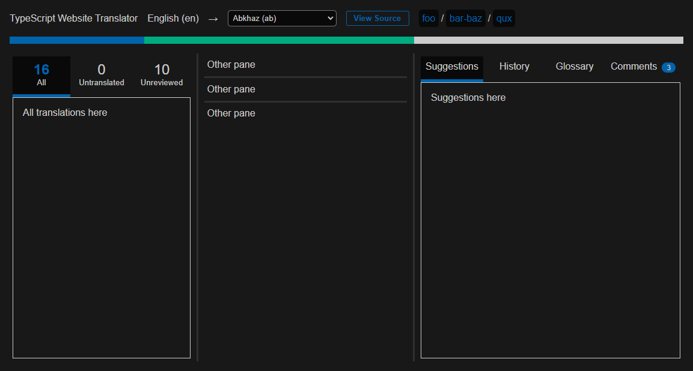

# TypeScript Website Translator

⚠️ **This is a Work in Progress** ⚠️

This project is a small **3rd party** Transifex-inspired translation app made to translate the TypeScript website.

## Description

This project allows to easily translate the TypeScript website into any language using an easy to use an familiar interface for translators.

> I don't think the team are likely to commit to migrating to a new service and setting all the localization from scratch - the current setup continues to run and allows for folks who have contributed to continue doing so even while the site has largely stopped receiving changes.
>
> *- [Orta](https://github.com/orta), in the TypeScript Community Discord server*

## Features

⚠️ **Since this is a Work in Progress, most features aren't available yet.** ⚠️

- [ ] **All strings in one place**, no need to open each file one by one
- [ ] **Progress overview**, to see how much of the website has been translated
- [ ] **Glossary**, for more consistent translations
- [ ] **Priority system**, to translate the most important strings first
- [ ] **Commit reminders**, to make sure translations are saved and the commits aren't too big

## Live version

You'll find a live version of this app at [typescript-website-translator.vercel.app/](https://typescript-website-translator.vercel.app/).

## How to use

To get started, you'll need to:

1. Clone the [TypeScript-Website-Localizations](https://github.com/microsoft/TypeScript-Website-Localizations)
2. In that repository, run `yarn` to install the dependencies
3. In that repository, run `yarn pull-en` to fetch the latest translations
4. Browse to the application (either the live or local version)
5. Point to the folder where you cloned the TypeScript-Website-Localizations repository
6. Select the language you want to translate the website to
7. Start translating!

Once you have made some translations, you can:

1. Run `yarn lint` to check for errors
2. Commit your changes
3. Create a pull request to the TypeScript-Website-Localizations repository

## How to run locally

1. Clone this repository
2. Run `npm i` to install the dependencies
3. Run `npm run dev` to start the Vite development server
